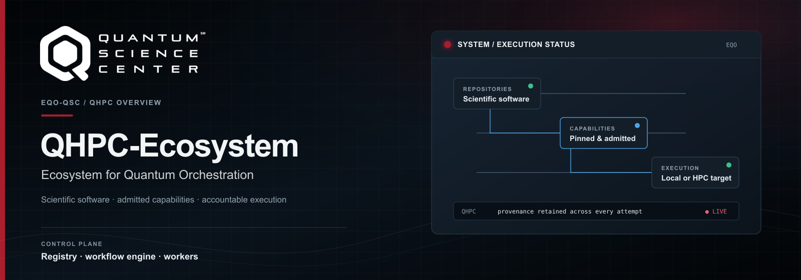
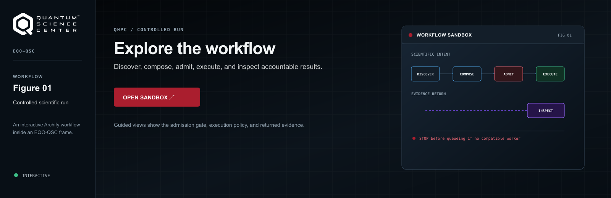

<p align="center">
  
</p>

# EQO — the QSC quantum-HPC ecosystem

EQO brings QSC quantum-HPC software, workflows, data, knowledge, and community
resources into one local Workbench. Start locally first; use the Workbench to
discover what is available, compose a workflow, and inspect its results.
Scientific source repositories remain independent.

## Start here: EQO Local

EQO Local is the recommended starting point. It runs a single-user Workbench,
control API, ChatQEC, an interactive worker, and the reviewed local
virtual-Slurm worker. That means the guided Compose workflows execute their
admitted tools—not merely their diagrams—while services remain bound to
loopback by default. No QPU, cloud, model-provider, or registry credential is
needed for the default scientific demonstrations.

### 1. Prerequisites

EQO Local requires a working Docker CLI connected to a running Docker daemon.
Install **Docker Engine** on Linux or **Docker Desktop** on macOS, then verify
that the invoking user can run:

```bash
docker version
```

Docker is required because EQO runs admitted tools in immutable OCI images; it
is not an optional add-on for the complete local profile. The first startup
downloads the Linux/AMD64 image set and can require several GB of disk space.

### 2. Install

From this repository, create an isolated Python environment and install the
local profile:

```bash
python3 -m venv .venv
. .venv/bin/activate
python -m pip install -e ".[local]"
```

This installs the **EQO Local Python profile**: the CLI, Workbench, control
services, bundled catalog and guidance, and the immutable QAppsWiki knowledge
graph used by the Knowledge workspace. A first launch does not require a
separate QAppsWiki checkout or graph build. The reviewed scientific OCI images
remain separate from the Python package; EQO runs those tools in their admitted
containers and never replaces an unavailable tool with a host-Python
substitute.

> **New: automatic image installation.** On the first `eqo local up`, EQO
> checks the approved `linux/amd64` image set and automatically downloads only
> images that are absent or have the wrong identity. Every download names an
> immutable GHCR digest, is tagged to EQO's required local name, and is verified
> before the Workbench starts. Later starts reuse the verified local images.
> Keep Docker Desktop running; the first download can take time and several GB
> of storage. See [public image distribution](docs/public-image-distribution.md).

The primary command is `eqo`. `qhpc-ecosystem` remains available as a
compatibility alias for existing scripts.

> **Running on Apptainer instead of Docker.** On systems without a Docker
> daemon (most HPC login and compute nodes), set `USE_APPTAINER=1` before
> starting EQO. Docker remains the default; the variable is a deliberate
> opt-in, never a silent auto-switch. Under `USE_APPTAINER=1`, EQO pulls each
> admitted image by its immutable `docker://…@sha256:` digest into a verified
> `.sif` in `~/.cache/qhpc-ecosystem/images/operations/`, records the SIF hash
> in a cache-side lock, and runs the supported local operation adapters with
> `apptainer run --containall --net --network none`. Building OCI images and
> the Docker Compose development fixtures (databucket/Garage, the Slurm test
> cluster) stay on Docker/Podman — those are build-host and validation
> concerns, not part of the Apptainer run path. The isolated network flag
> requires an Apptainer install that permits an unprivileged network namespace
> (a setuid install, or `allow net`); EQO fails rather than sharing the host
> network. See
> [public image distribution](docs/public-image-distribution.md).
>
> ```bash
> USE_APPTAINER=1 eqo local up --open
> ```

### 3. Start and open the Workbench

```bash
eqo local up --open
```

The command prints the Workbench address and opens it when your system permits.
Keep that terminal open while you use EQO. To reopen an already running
Workbench, use `eqo local open`.

### 4. Let EQO start the complete execution profile

The first `eqo local up` starts the isolated virtual-Slurm fixture and obtains
or verifies the exact OCI images used by the guided workflows: **QASMTrans,
STABSim, NWQEC, FTPrimitiveBench, LightStim, FTQC**, and the ChatQEC tool
images. Docker Desktop is required. This is a local development scheduler—not
a DOE HPC system—but every scientific tool runs in its own admitted container.

- **Working from this source workspace:** when the pinned `FTQC` checkout is a
  sibling of this repository (`../FTQC`), EQO discovers it and the checked-in
  runtime contract automatically. If the admitted image is absent, EQO builds
  that one checksum-pinned image.
- **Using a packaged EQO installation:** startup obtains missing admitted OCI
  images from the fixed GHCR release manifest. If a release's images have not
  yet been made public, authenticate Docker to GHCR with the access supplied by
  its release owner; public release images require no GitHub login. EQO never
  downloads an arbitrary tag or substitutes a host-native tool. FTQC
  additionally accepts a separately managed source checkout and runtime
  contract through `--ftqc-source-checkout` and `--ftqc-runtime-manifest`.

If you only need discovery and the lightweight interactive tools, use
`eqo local up --no-ecosystem-execution`. The default remains the complete
ecosystem execution profile. See [the EQO Local guide](docs/local-release.md)
for its container and lifecycle details.

### 5. Explore the Workbench

| Area | Start here when you want to… |
| --- | --- |
| **Overview** | See the ecosystem and local service state. |
| **Tools** | Discover integrated software and read its published guidance. |
| **Data** | Browse available data-service records. |
| **Knowledge** | Explore QAppsWiki-connected ecosystem knowledge. |
| **Engagement** | Open public course material, training tutorials, and community events. |
| **Assistant** | Ask the local, citation-backed ChatQEC fallback about QEC concepts. |
| **Compose** | Start a guided workflow or build an advanced typed workflow. |
| **Runs** and **Artifacts** | Follow execution and inspect provenance-linked results. |

### 6. Check, stop, or recover

```bash
eqo local status
eqo local down
```

After updating EQO, restart the local stack so its API and Workbench load the
new version:

```bash
eqo local down
eqo local up --open
```

For diagnostics, backup, restore, and optional local runtime management, see
[the EQO Local guide](docs/local-release.md):

```bash
eqo local diagnose
eqo local export
eqo local import /path/to/eqo-local-export.eqo
eqo local runtime list
```

## Everyday EQO use

### Browse Engagement Thrust resources

The Engagement catalog is intentionally read-only: its courses, tutorials, and
events are visible in EQO without becoming tools, services, runtimes,
credentials, or workflow targets.

```bash
eqo engagement list
eqo engagement list --json
```

### Use EQO from Python or Jupyter

The dependency-free `eqo` client connects to the same local control API. It
does not start services, pull images, import project tools, or resolve QPU or
model credentials.

```python
from eqo import EQOClient

client = EQOClient.connect("http://127.0.0.1:8080")

for resource in client.engagement.list():
    print(resource["title"], resource["url"])

capabilities = client.capabilities.list()
answer = client.assistant.ask("What is the surface code?")
```

Workflow submission is explicit. It creates a run only after you choose a
published workflow and a compatible local worker is available:

```python
workflow = client.workflows.latest("WORKFLOW_ID")
run = client.workflows.submit(workflow["id"], workflow["version"])
completed = run.wait(timeout=300)
artifacts = completed.artifacts
```

For notebooks, install the optional helper and use the safe rich views. They
render escaped, size-bounded summaries; SVG and binary artifacts are described
rather than embedded.

```bash
python -m pip install -e ".[jupyter]"
```

```python
from eqo import render_artifact, render_citations, render_run

render_run(completed)
render_artifact(artifacts[0])
render_citations(answer["citations"])
```

The [notebook catalog](examples/notebooks/README.md) maps every admitted tool
and integration to an example: individual capability inspection, typed-input
workflows, multi-tool paths such as OpenQEvo → QASMTrans → STABSim/NWQEC and
FTPrimitiveBench → LightStim, the full ChatQEC tool gallery, and FTQC → IQM.
The IQM notebook detects an admitted simulation or internal hardware worker;
credentials remain worker-local and never enter notebook state.

### Optional IQM simulation

To explore the FTQC–IQM path without a credential or network connection, start
the safe simulation worker:

```bash
eqo local up --iqm-simulation --open
```

Its results are labelled `simulated-iqm`; this does not submit to IQM hardware
or constitute hardware evidence. For the internal alpha, real IQM execution
requires the isolated worker, one device alias, and a worker-local credential.

### Run an IQM experiment (internal alpha)

Use the simulation path above first if you want to inspect the complete
prepare → route → collect flow without contacting IQM. To run the experiment
on the internal IQM machine, install the optional provider once in the active
EQO environment, then restart EQO with its isolated IQM worker:

```bash
python -m pip install -e ".[iqm]"

eqo local down
export IQM_BASE_URL='https://qccsw.ccs.ornl.gov'
eqo local up \
  --start-iqm-worker \
  --iqm-device-alias iqm-qpu-1 \
  --prompt-for-iqm-token \
  --open
```

The final command asks for `IQM_TOKEN` without echoing it. The token is passed
only to the IQM worker; do not paste it into the Workbench or add it to a
workflow. Starting the worker does **not** submit an experiment.

In the Workbench, open **Guided** and choose **Route and execute one Steane
logical qubit**. Click **Load logical |0⟩**, review the circuit, then click
**Run workflow**. That action submits the bounded 512-shot job. The completed
run records the FTQC preparation artifacts, routed layout and calibration
identity, redacted job receipt, raw counts, and decoded logical result.

This is an internal-alpha hardware path. A completed run is a preserved
execution record, not by itself a claim of error suppression or fault-tolerant
advantage. See the [FTQC–IQM worker guide](docs/ftqc-iqm-worker.md) for the
execution boundary and troubleshooting.

## Where to get help

- **Something changed but the UI looks old:** run `eqo local down` followed by
  `eqo local up --open`.
- **EQO does not start:** run `eqo local diagnose`, then consult
  [the Local guide](docs/local-release.md).
- **You need a feature’s current boundary:** read its Tool Record in the
  Workbench, then follow the linked documentation and source provenance.
- **You are preparing a deployment or HPC target:** begin with
  [deployment readiness](docs/deployment-readiness.md), not the local profile.

---

## Technical reference

This section is for contributors, integrators, release engineers, and HPC site
operators. It explains the boundaries behind the local experience.

<p align="center">
  <a href=".github/assets/qhpc-ecosystem-workflow-sandbox.html">
    
  </a>
</p>

*A controlled EQO scientific run progresses from discovery and typed
composition through capability admission and worker leasing to inspectable
artifacts and provenance. [Open the workflow sandbox](.github/assets/qhpc-ecosystem-workflow-sandbox.html)
for guided views, focus, trace, and export controls.*

### Architecture and deployment boundary

EQO combines a curated repository inventory, reusable Apptainer developer
environments, an attributed capability registry, a persistent workflow engine,
controlled workers, a versioned API, and a browser Workbench. The local API and
worker use persistent SQLite task leases. A production deployment separates the
control plane, task-executing workers, storage, and browser Workbench.

The target control, execution, data, container, and storage boundaries are
defined in [docs/architecture.md](docs/architecture.md). Architecture decisions,
integration contracts, curator evidence, and deployment readiness are maintained
under [docs/](docs/).

The first deployment uses the explicit allowlist in
[deployments/initial.yaml](deployments/initial.yaml). It publishes capability
records for STABSim, TN-Sim, NWQEC, FTPrimitiveBench, LightStim, QASMTrans,
FTQC, OpenQEvo, OpenQSE, QAppsWiki, QSC Materials Repository, ChatQEC, ExaChem
QFlow, QIRIS over IRIS/QIR-EE, and the NWQSim QFlow VQE plugin. Roles,
onboarding state, and production gates are in
[docs/initial-deployment.md](docs/initial-deployment.md).

#### Component status highlights

- **OpenQSE** is a pinned glossary and architecture resource, not a tool or
  service. The separately cataloged QFw–SLURM Cluster remains a planned,
  non-executable development-cluster reference.
- **ChatQEC** is currently a supervised, citation-backed canonical-corpus
  extractive fallback. It is not the upstream model-backed research assistant.
  See [the service boundary](docs/chatqec-service-boundary.md).
- **FTQC–IQM** has typed preparation and simulated acceptance paths. Real QPU
  submission remains a separately credentialed, site-admitted stage.
- **QFlow/QIRIS** records are visible for discovery and knowledge, but publish
  no Compose or Run action until their source, runtime, and HPC gates pass.

The detailed status matrix is in
[docs/deployment-readiness.md](docs/deployment-readiness.md), and immutable
operation-image status is in
[containers/operations/README.md](containers/operations/README.md).

### Advanced local and development operations

The `dev` supervisor is a development stack, not the default entry point. It
prepares the virtual Slurm fixture, serves the API, starts separate local and
virtual-Slurm workers, and supervises the local ChatQEC service:

```bash
python -m pip install -e ".[dev,workbench]"
eqo dev up
```

The optional Data panel integration uses a prepared
[`databucket`](https://github.com/naughtont3/databucket) checkout:

```bash
eqo dev up --databucket-checkout /path/to/databucket
```

See [the databucket integration guide](docs/databucket-integration.md) for
Garage setup, credentials, API behavior, and direct-panel testing. See
[docs/repository-updates.md](docs/repository-updates.md) for the controlled
source-update lifecycle.

For process-level debugging, run the API and worker separately:

```bash
eqo serve --registry examples/registry.yaml \
  --deployment-profile deployments/initial.yaml

eqo worker --registry examples/registry.yaml \
  --deployment-profile deployments/initial.yaml \
  --runtime-root .qhpc/runtimes
```

Workflow and run state can also be managed from the command line:

```bash
eqo workflow validate workflow.yaml --registry registry.yaml
eqo workflow list
eqo run-record submit WORKFLOW_ID VERSION
eqo run-record list
eqo run-record info RUN_ID
eqo run-record cancel RUN_ID
eqo run-record retry RUN_ID NODE_ID
eqo run-record export RUN_ID --output run-bundle.json
```

### Catalog, registry, and contract operations

Catalog inspection works without a container runtime or network access:

```bash
eqo list
eqo info OpenQEvo
eqo validate
eqo sync-manifest --check
eqo updates list
eqo updates check
```

Use the contract and integration commands to inspect pre-runtime admission:

```bash
eqo contract list
eqo contract validate capability examples/contracts/valid/capability.yaml
eqo contract validate operation-interface integrations/nwqec/interface.yaml
eqo contract validate operation-runtime containers/operations/qasmtrans/runtime.yaml
eqo contract validate service-interface integrations/chatqec/service.yaml
eqo integration validate deployments/initial.yaml
eqo integration list deployments/initial.yaml
```

Project release checkouts containing `qhpc-capability.yaml` can be aggregated
into a deterministic registry:

```bash
eqo registry build --source /path/to/project-release --output registry.yaml
eqo registry validate registry.yaml
eqo registry list registry.yaml
```

`ecosystem.yaml` is the reviewed inventory corresponding to
`catalog/repositories.tsv`. Deployment admission is separate: `serve` exposes
only registry records on the selected profile’s non-blocked allowlist.
`sync-manifest` changes only source-owned fields and never mutates active
capability or runtime pins. See [docs/registry.md](docs/registry.md) and
[ADR 0011](docs/adr/0011-controlled-repository-updates.md).

### Containers and HPC execution

#### Environment classes

| Class | Intended use |
| --- | --- |
| `python-lib` | Python libraries, frameworks, decoders, and lightweight benchmarks |
| `hpc-build` | C/C++, Fortran, CMake, MPI, compilers, and native simulators |
| `schema-docs` | Schemas, catalogs, documentation, and knowledge graphs |
| `agentic` | RAG, agents, SDK dashboards, and Python/Node.js tools |
| `packaging` | Spack repository development and HPC package maintenance |

Developer environments provide Apptainer `shell` and `run` access with source
bound at `/workspace`. Operation runtimes are separately reviewed,
tool-specific immutable Linux images used by workers. The two are intentionally
not interchangeable.

```bash
eqo build OpenQEvo
eqo shell OpenQEvo
eqo run OpenQEvo -- python3 -m pytest

eqo operation-runtime verify containers/operations/qasmtrans/runtime.yaml
eqo operation-runtime build-oci \
  containers/operations/qasmtrans/runtime.yaml /path/to/qasmtrans \
  --context .qhpc/build/qasmtrans --tag qhpc/qasmtrans:1843c98-linux-amd64
```

An OCI image is not an accepted HPC runtime by itself. Immutable publication,
SIF conversion, supply-chain evidence, target storage policy, and target
Slurm/Apptainer acceptance remain separate gates. The production-shaped path is
documented in [docs/hpc-execution.md](docs/hpc-execution.md).

For scheduler development, use the revision-pinned Slurm Docker fixture:

```bash
eqo slurm-test-cluster prepare \
  infrastructure/test-clusters/slurm-docker-cluster/cluster.yaml \
  --build-ca /approved/path/development-build-ca.pem
eqo slurm-test-cluster start \
  infrastructure/test-clusters/slurm-docker-cluster/cluster.yaml
eqo slurm-test-cluster smoke \
  infrastructure/test-clusters/slurm-docker-cluster/cluster.yaml
eqo hpc-acceptance status infrastructure/hpc-acceptance/initial.yaml
```

### Building, testing, and releasing

Run the local test suite with:

```bash
pytest
```

The suite does not claim DOE target-system acceptance. Institutional identity,
SIF releases, live Slurm and pilot execution, storage/RDMA performance, and
security reviews remain target-environment work.

When changing the TypeScript Workbench source, rebuild and verify its committed
production assets:

```bash
npm ci --prefix workbench/frontend
npm run check --prefix workbench/frontend
npm test --prefix workbench/frontend
npm run build --prefix workbench/frontend
npm run test:e2e --prefix workbench/frontend
```

Create a clean local release candidate with:

```bash
python tools/build_local_release.py
```

The build verifies the Python suite, package contents, production Workbench
assets, and wheel checksum. Release evidence and remaining publication gates
are documented in [docs/local-release.md](docs/local-release.md).
